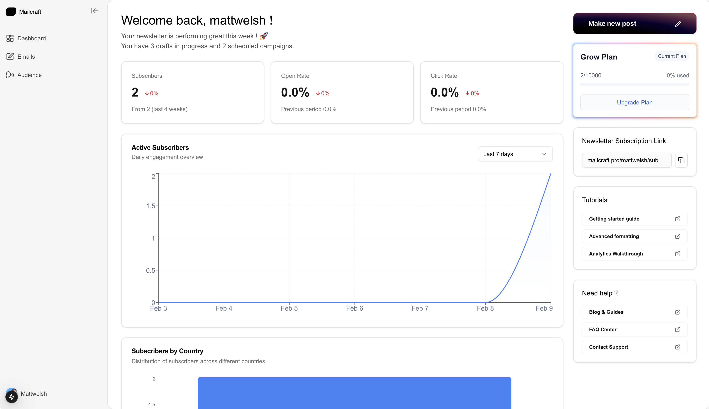
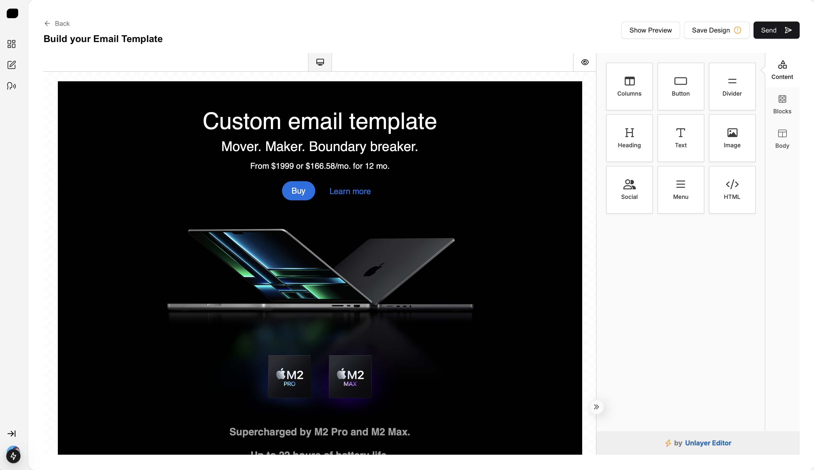
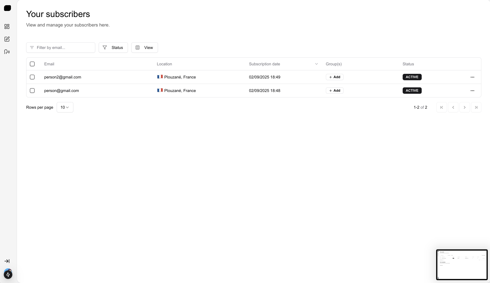
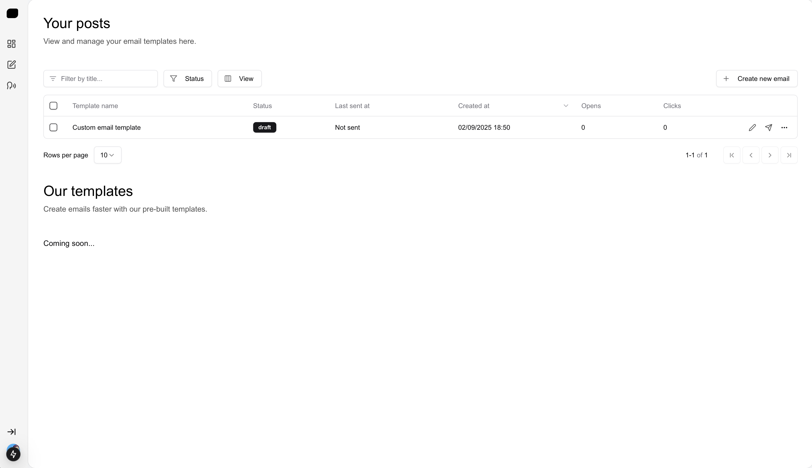
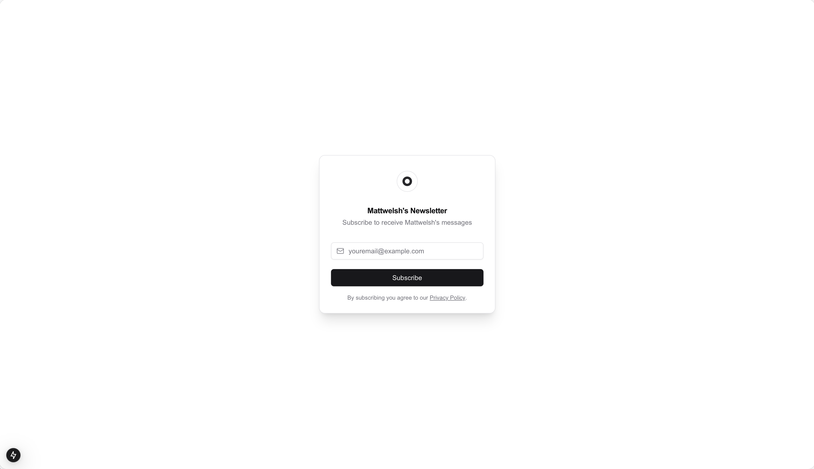
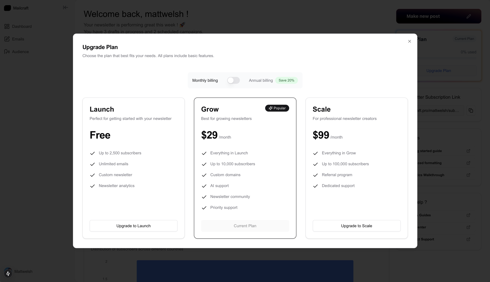

# Mailcraft

Mailcraft is a powerful newsletter management platform that allows creators to build and manage their email subscriber base with ease. Built with Next.js, this platform provides a seamless experience for both newsletter creators and subscribers.

## 📸 Interface Showcase

### Dashboard Overview

*Main dashboard with key metrics and performance indicators*

### Email Builder

*Intuitive email builder interface for creating engaging newsletters*

### Subscriber Management

*Comprehensive subscriber management and analytics*

### Email Campaign History

*Track and manage your email campaigns*

### Subscriber Portal

*Clean and simple subscription interface for your audience*

### Premium Plans

*Flexible pricing plans to suit different newsletter needs*

## Features

- 🔐 Secure authentication system
- 📧 Newsletter subscription management
- 💳 Stripe integration for premium subscriptions
- 📊 Subscriber analytics with country-based insights
- 👤 Custom profile pages for creators
- 📱 Responsive design for all devices
- ⚡ Real-time updates and notifications

## Tech Stack

- **Framework**: Next.js 14 with App Router
- **Authentication**: NextAuth.js
- **Database**: Prisma ORM
- **Styling**: Tailwind CSS
- **Payment Processing**: Stripe
- **Analytics**: Custom implementation with geolocation data
- **Deployment**: Vercel

## Prerequisites

Before you begin, ensure you have the following installed:
- Node.js 18.x or later
- npm or yarn package manager
- A Stripe account for payment processing
- PostgreSQL database

## Environment Variables

Create a `.env` file in the root directory with the following variables:

```env
# Database
DATABASE_URL="your_database_url"

# Authentication
NEXTAUTH_SECRET="your_nextauth_secret"
NEXTAUTH_URL="http://localhost:3000"

# Stripe
STRIPE_SECRET_KEY="your_stripe_secret_key"
STRIPE_PUBLISHABLE_KEY="your_stripe_publishable_key"
STRIPE_WEBHOOK_SECRET="your_stripe_webhook_secret"
```

## Getting Started

1. Clone the repository:
```bash
git clone https://github.com/yourusername/mailcraft.git
cd mailcraft
```

2. Install dependencies:
```bash
npm install
# or
yarn install
```

3. Set up the database:
```bash
npx prisma generate
npx prisma db push
```

4. Run the development server:
```bash
npm run dev
# or
yarn dev
```

Open [http://localhost:3000](http://localhost:3000) with your browser to see the application.

## Project Structure

```
mailcraft/
├── app/                    # Next.js app directory
│   ├── api/               # API routes
│   ├── components/        # Reusable components
│   └── [username]/        # Dynamic user routes
├── lib/                   # Utility functions and configurations
├── prisma/               # Database schema and migrations
└── public/               # Static assets
```

## Contributing

1. Fork the repository
2. Create your feature branch (`git checkout -b feature/amazing-feature`)
3. Commit your changes (`git commit -m 'Add some amazing feature'`)
4. Push to the branch (`git push origin feature/amazing-feature`)
5. Open a Pull Request

## License

This project is licensed under the Mailcraft Non-Commercial License - see the LICENSE file for details. This license explicitly prohibits any commercial use of the software. The software may only be used for personal, educational, research, or other non-commercial purposes.
